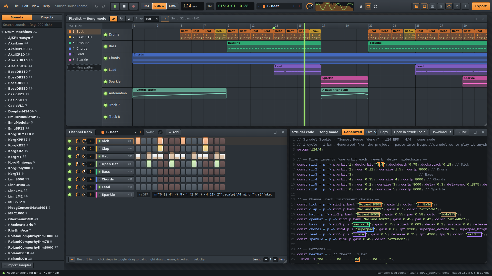
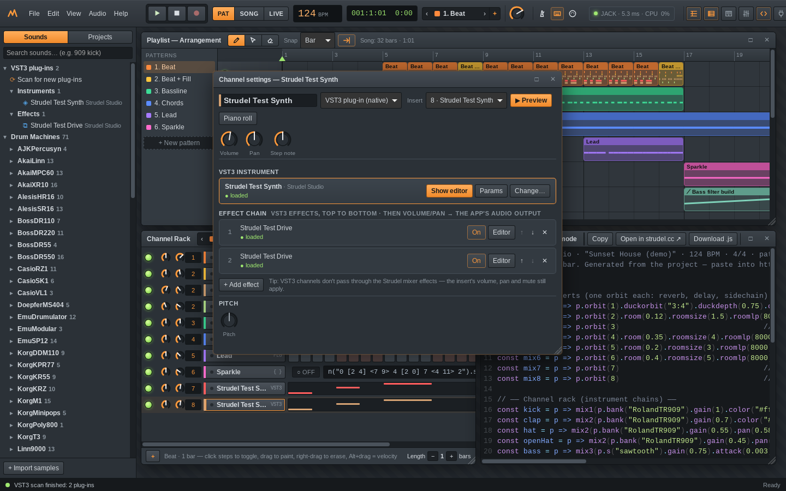

# Strudel Studio

An FL Studio–style music production suite built on the [Strudel](https://strudel.cc) live-coding engine.
Channel rack, piano roll, playlist, mixer, automation, plugins and WAV export — and every note you make is
compiled to real Strudel code in real time, so you can keep live-coding on top of it or open it on strudel.cc.



## Start it (Windows)

Double-click **`Start Strudel Studio.bat`**. It starts a tiny local web server (built-in Windows PowerShell,
nothing to install) and opens the studio in your browser at `http://localhost:5190`. Use Chrome or Edge for
the best audio performance. Click anywhere once to enable audio, then press **Space**.

An internet connection is needed the first time sounds play — like strudel.cc, the drum machines, Dirt-Samples,
VCSL instruments and GM soundfonts stream from GitHub. Your own imported samples stay in the browser.

## The native app: real VST3 plug-ins, ASIO and MIDI (Windows)

Strudel Studio also comes as a desktop program built with [JUCE](https://juce.com/features/). It shows exactly
the same studio, and adds what a browser can't do:

* **VST3 instruments and effects** — a *VST3 channel* in the channel rack hosts any VST3 instrument plus a chain
  of VST3 effects, with the plug-ins' own editor windows. Program it with steps, the piano roll, code channels or
  your MIDI keyboard like every other channel; it's automated by the same arrangement and included in WAV exports.
  Plug-in settings are saved inside the project file.
* **Low-latency audio** — ASIO, WASAPI (shared/exclusive) or DirectSound with your choice of device, sample rate
  and buffer size (*Audio → Audio & MIDI settings*).
* **MIDI devices** are opened natively (always on, hot-plug) and play the selected channel with minimal latency.
* **Native file dialogs** for projects and exports.



**Start it:** double-click **`Strudel Studio.exe`** in this folder (a ready-made build is included, together with
two example plug-ins in `VST3\`: *Strudel Test Synth* and *Strudel Test Drive*). It needs the Microsoft Edge
WebView2 runtime, which ships with Windows 10/11.

**Build it yourself:** double-click **`Build Native App.bat`**. If the free Microsoft C++ Build Tools aren't
installed, the script installs them with `winget` first (one time, a few GB, 10–20 minutes, Windows may ask for
admin permission). It then downloads JUCE 9 and the WebView2 SDK, compiles with MSVC, and replaces
`Strudel Studio.exe` and the example plug-ins. A log is written to `native\build.log`.

**Use it:** start `Strudel Studio.exe` → *Audio → Scan for new VST3 plug-ins* → double-click an instrument in the
browser's **VST3 plug-ins** folder (or channel rack **+** → *VST3 instrument*) → *Show editor* in its channel
settings. Plug-ins in the standard folders (`C:\Program Files\Common Files\VST3`,
`%LOCALAPPDATA%\Programs\Common\VST3`) and in `VST3\` next to the app are found; add more folders under
*Audio → VST3 folders*.

Good to know: the Strudel sounds still play through the WebView (Windows audio) while VST3 channels play through the
device you pick in the native settings — both are time-aligned automatically; if they drift apart on your system,
set *Audio → VST3 timing offset*. If you choose an ASIO driver, make sure your interface still allows Windows audio
at the same time (most do), or use WASAPI. VST3 channels bypass the Strudel mixer effects (their insert's volume,
pan and mute still apply) — use VST3 effects in their chain instead. In the browser version a VST3 channel plays a
simple stand-in synth. Details: [native/README.md](native/README.md).

### Developer mode (optional, needs Node.js 18+)

```bash
npm install
npm run dev        # hot-reloading dev server on http://localhost:5173
npm run build      # type-check + rebuild the app/ folder used by the launcher
npm test           # compiler tests (Strudel code generation, evaluated with the real engine)
node tests/e2e.mjs # end-to-end browser test (needs Playwright's Chromium)

# native app (any OS with CMake + a C++20 compiler; Linux also needs webkit2gtk-4.1, gtk3, alsa, jack dev packages)
cmake -S native -B native/build -G Ninja -DCMAKE_BUILD_TYPE=Release   # add -DJUCE_DIR=... to use a local JUCE
cmake --build native/build
tests/native-linux.sh   # headless end-to-end test of the native app (Xvfb + JACK dummy driver + example plug-ins)
```

## What's inside

| Window | What it does |
| --- | --- |
| **Channel rack** (F6) | Step sequencer with per-step velocity (Alt+drag), swing, pattern length, mute/solo, pan/volume, mixer routing, fill/shift/randomize. Drag sounds in from the browser. |
| **Piano roll** (F7) | Draw/select/erase tools, snap (bar … 1/32, triplets), chord stamps, scale highlighting, ghost notes, velocity lane, quantize, legato, arpeggiate, strum, copy/paste/duplicate, transpose. |
| **Playlist** (F5) | Paint patterns onto 16 tracks to arrange a song; move, resize, Shift-drag copy, loop region, song position, follow playhead, automation clips, "make unique". |
| **Mixer** (F9) | 16 inserts + master with faders, pan, meters, mute/solo. Per insert: Strudel reverb/delay/DJ-filter, **sidechain ducking**, and up to 8 native effect slots. |
| **Strudel code** (F10) | Live view of the generated code with active-event highlighting, copy / download / open in strudel.cc, and a **Live code** editor where your patterns and instruments are in scope. |
| **Channel settings** | Sound selection (drum machine banks, samples, synths, soundfonts, plugins), envelope, filter + filter envelope, pitch, vibrato, sample start/end, choke groups, distortion, bit-crush, phaser, tremolo, vowel… |
| **Automation clips** | Right-click any automatable knob → *Create automation clip*. Compiles to Strudel signals. |
| **Plugin Lab** (F8) | Write your own instruments in JavaScript, test-render them, save them with the project. |
| **Export** (Ctrl+R) | Offline WAV render (16/24/32-bit, 44.1/48/96 kHz), stems per mixer insert, MIDI file, Strudel code. |

Also: VST3 channels in the native app (see below), typing-keyboard piano and Web MIDI input with recording into the piano roll, metronome, tap tempo, time
signatures, undo/redo, autosave, project files (`.strudel-studio.json`), a browser-side project library,
sample import (drag audio files onto the browser), and two demo songs.

### Modes

* **PAT** – loops the selected pattern.
* **SONG** – plays the playlist arrangement (click the ruler to set the position, drag it for a loop region).
* **LIVE** – plays the Live-code editor (`Ctrl+Enter`), with your project's instruments and patterns available.

## “VSTs” for Strudel

Strudel has no plugin format, but its audio engine (superdough) lets any code register a sound:
`registerSound(name, onTrigger)`. Strudel Studio builds a small plugin SDK on top of that plus
`registerControl` (which adds pattern methods such as `.triosc_w1(2)`):

```js
definePlugin({
  id: 'mysynth',                       // use it as .s("mysynth")
  name: 'My Synth',
  params: { detune: { label: 'Detune', min: 0, max: 50, def: 12 } },   // -> .mysynth_detune(20)
  envelope: { a: 0.01, d: 0.3, s: 0.6, r: 0.3 },
  voice({ ac, t, dur, freq, p, a, d, s, r, adsr }) {                  // called for every note
    const osc = ac.createOscillator();
    osc.frequency.value = freq; osc.detune.value = p.detune;
    const env = ac.createGain();
    osc.connect(env); osc.start(t);
    const end = adsr(env.gain, t, dur, a, d, s, r);
    return { node: env, sources: [osc], end };
  },
});
```

Because plugins only use public Strudel APIs, the same source runs in the studio, in code channels, in the WAV
export — and on strudel.cc: the code exporter embeds the SDK and the plugin sources. (This was verified by
loading the exported demo song on strudel.cc: the plugin sounds register and the song plays.)

Stock instrument plugins: **3xOsc**, **SuperPad**, **FM Keys**, **ChipBoy**, **Sub 808**, **Pluck**
(Karplus-Strong in an AudioWorklet) and **DrumSynth** (kick, snare, hats, clap, tom, cowbell).

Mixer insert effects are native WebAudio “effect plugins” (they run in the studio and in its WAV export, not on
strudel.cc): EQ 3-band, Compressor, Limiter, Chorus, Stereo Width, Auto Filter, Drive, Lo-Fi, Ping-Pong Delay,
Space Reverb.

## How it works

```
Project (channels, patterns, playlist, mixer)  ──compile──▶  Strudel code  ──▶  Strudel REPL (scheduler + superdough)
          ▲                                                                              │ orbits = mixer inserts
          └──────────── React UI (windows) ◀── meters, playhead, LEDs ◀── native mixer graph (FX, faders, limiter)
```

* `src/model/compile.ts` turns the project into readable Strudel code: 1 cycle = 1 bar, patterns become
  mini-notation, the playlist becomes `arrange(...)`, automation becomes `signal` curves, mixer inserts become
  orbits (`.orbit(n)` with reverb/delay/`duckorbit` sidechain).
* `src/engine/engine.ts` runs one Strudel REPL, hot-swaps the code on every edit, renders WAVs with an
  `OfflineAudioContext`, and re-routes each orbit through a native insert strip (`src/engine/graph.ts`).
* `src/plugins/` holds the plugin SDK, stock instruments and native effects.
* `src/native/` is the bridge to the native app; `native/` is the JUCE C++ program (WebView host, audio engine,
  VST3 hosting). A VST3 channel compiles to `.s("native").vst('<channel id>')`: Strudel still does all the
  sequencing and the `native` sound sends each note with its exact timestamp to the native engine.
* `vite.config.ts` applies two small compatibility patches to superdough (audio-node pooling across
  audio contexts) that make sample-accurate offline rendering reliable.

## Shortcuts

Space play/stop · Esc stop · F5–F10 windows · F4 new pattern · Ctrl+Z/Y undo/redo · Ctrl+S save ·
Ctrl+O open · Ctrl+R export · Z…M / Q…P typing piano (−/= octave) · knobs: drag, wheel, Shift = fine,
double-click = reset, right-click = automation. Press F1 in the app for the full list.

## License

AGPL-3.0-or-later, like Strudel itself (see `LICENSE`). Strudel © its contributors — https://codeberg.org/uzu/strudel.
Sample libraries are streamed from their original repositories under their respective licenses.
